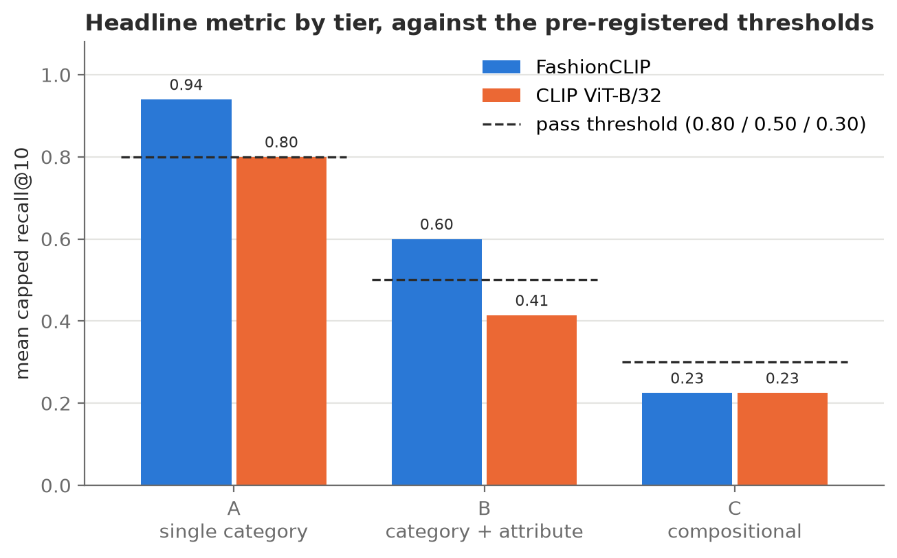
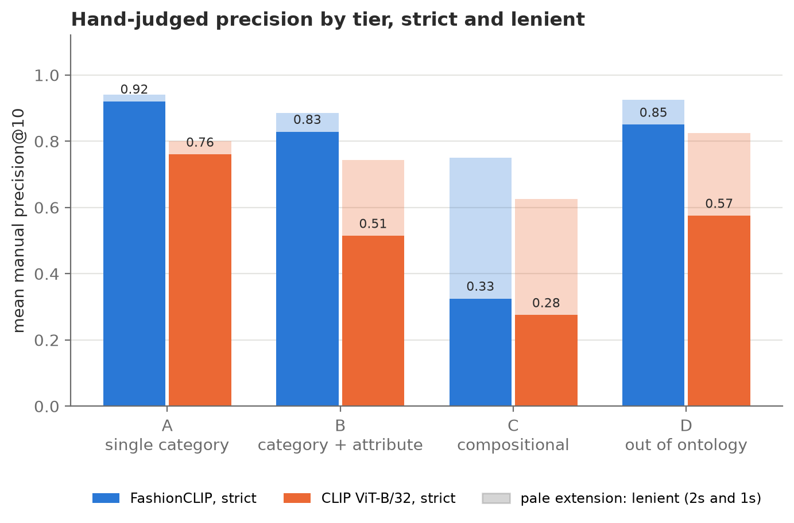
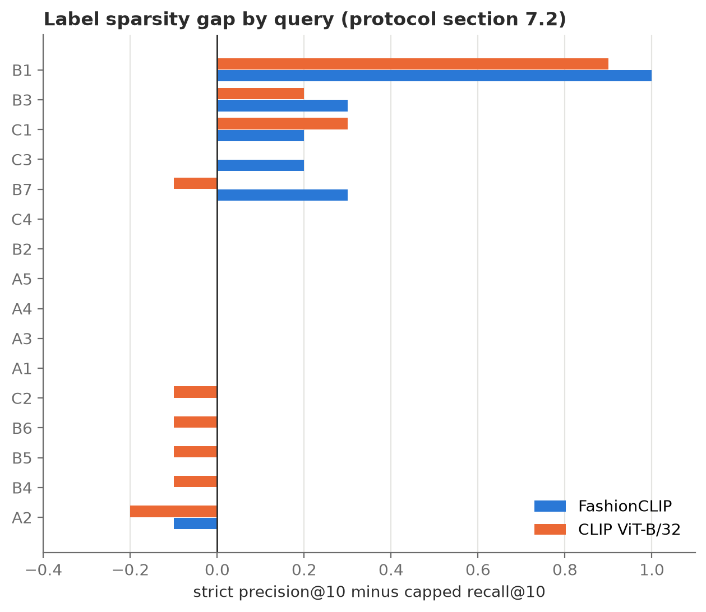
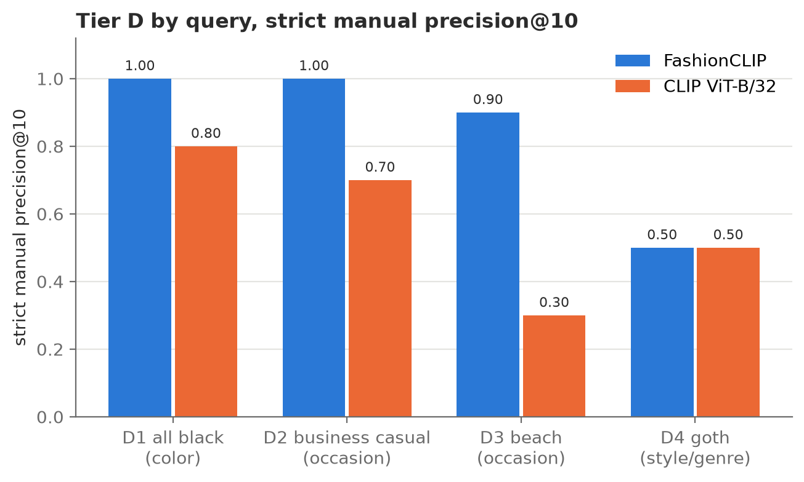

# Garment Search

Text-to-image search over garment photography. A natural-language query such as
`oversized blazer` or `striped shirt` is embedded into the same vector space as
45,622 Fashionpedia images, and the closest images come back as results.

This project asks two questions. Does a fashion-specific model (FashionCLIP)
retrieve garments better than general-purpose CLIP? And how far can either one
be trusted once a query moves past a single garment to attributes, combinations
of garments, and style? The evaluation was pre-registered: the 20 test queries,
their relevance criteria, the metrics, the pass thresholds and six predicted
failure modes were committed to [`docs/eval_protocol.md`](docs/eval_protocol.md) before the first image was embedded.

**FashionCLIP retrieves better overall (capped recall@10 of 0.612 against
0.488). Both models fail on compositional queries, and fit words are
unreliable: neither model returns a clearly oversized blazer, and CLIP mostly
ignores "baggy".** Hand judging also showed that Fashionpedia's own
labels miss a large share of correct results: of the judged images the metadata
counted as irrelevant, 28% were clearly relevant.

## Data and licensing

[Fashionpedia](https://fashionpedia.github.io/home/) (Jia et al., ECCV 2020):
48,825 clothing images with COCO-format instance annotations, built on an
ontology of 46 apparel categories (27 main garments and 19 garment parts) and
294 fine-grained attributes. Checked against the annotation file itself, the
attributes sit in 11 super-categories rather than the 9 the paper describes, and none of the 294 describes color.

- **Indexed set:** every training image with at least one main-garment
  annotation, n = 45,622 of the 45,623 in the file. The one dropped image is
  annotated only with garment parts.
- **Held out:** `val2020` (n = 1,158) is not indexed.
- **Not used:** `test2020`, since its attribute annotations aren't public.

**Licensing.** The annotations and ontology are released under CC BY 4.0. The
images are not Fashionpedia's to license. They were collected from Flickr,
Unsplash, Burst, Freestocks, Kaboompics and Pexels, each under its own terms,
and Fashionpedia's terms of use place the responsibility for complying with
those terms on the dataset user. So no image is committed to this repo:
`data/raw/` is git-ignored and rebuilt by `pipeline/01_download.py`, and the
notebooks that display images are committed with their outputs cleared. No
scraped or commercial fashion photography is used anywhere in the project.

## Methodology

- **Models.** FashionCLIP (`patrickjohncyh/fashion-clip`, revision `7e3ba62`)
  against OpenAI CLIP ViT-B/32 (`openai/clip-vit-base-patch32`, revision
  `3d74acf`), both used zero-shot. Both load through Hugging Face `transformers`
  and share the same preprocessing and embedding code, so the comparison
  isolates the weights. Queries are embedded as raw strings with no
  `"a photo of ..."` template, a choice fixed in advance so the template isn't
  tuned against the test set.
- **Index.** FAISS `IndexFlatIP` over L2-normalized 512-dimensional embeddings,
  which gives exact cosine similarity. At 45,622 vectors, an approximate index
  would only add approximation error that gets mixed in with model quality.
- **Queries.** 20 queries across four tiers: single category (A, 5), category
  plus one attribute (B, 7), compositional (C, 4), and out of ontology, meaning
  color, occasion and style (D, 4). Tier D was predicted in advance to fail.
- **Metadata relevance (primary).** Each Tier A to C query has a predicate over
  Fashionpedia's labels. For example, B2 `striped shirt` matches an image
  containing a `shirt, blouse` instance that carries the `328:stripe`
  attribute. The headline metric is capped recall@10:

  ```text
  capped recall@10 = |R ∩ top10| / min(|R|, 10)
  ```

  Plain recall@10 can't exceed 10/|R|, which for `cardigan` (|R| = 1,101) is
  below 0.01 even for a perfect system. The capped version equals precision@10
  whenever |R| ≥ 10, so it stays readable for large and small relevant sets
  alike. Plain recall, mean reciprocal rank (MRR) and the rank of the first
  relevant result are reported alongside it in `results/metrics.csv`.
- **Manual relevance (secondary).** I judged the top 10 for every query, model
  and condition by hand against the written prose criteria in the protocol, on a
  scale of 2 (clearly relevant), 1 (arguably relevant) and 0 (not relevant).
  That came to 391 unique query-image pairs. The pairs were pooled across both
  models and shuffled with a fixed seed, so I never saw which model returned an
  image or at what rank. Strict precision@10 counts only 2s, lenient counts 2s
  and 1s, and every judgment has a logged reason in
  [`docs/relevance_judgments.csv`](docs/relevance_judgments.csv).
- **Category filter.** Each Tier B query also runs with a hard filter on its
  garment category. It's reported as a separate condition, so the headline
  numbers reflect what the embeddings do on their own.
- **Pre-registered thresholds** on capped recall@10: Tier A ≥ 0.80, Tier B ≥
  0.50, Tier C ≥ 0.30. Any single query below 0.30 is a failure case, and its
  retrieved images get inspected and categorized against the predicted failure
  modes.

## Results

| | FashionCLIP | CLIP ViT-B/32 |
|---|---|---|
| Capped recall@10, Tiers A to C (n = 16) | **0.612** | 0.488 |
| MRR, Tiers A to C | **0.774** | 0.641 |
| Strict manual precision@10, all 20 queries | **0.755** | 0.540 |
| Lenient manual precision@10, all 20 queries | **0.880** | 0.750 |

| Tier | Threshold | FashionCLIP | CLIP ViT-B/32 |
|---|---|---|---|
| A: single category | ≥ 0.80 | 0.94, pass | 0.80, pass |
| B: category + attribute | ≥ 0.50 | 0.60, pass | 0.41, **fail** |
| C: compositional | ≥ 0.30 | 0.23, **fail** | 0.23, **fail** |



FashionCLIP scored higher on 8 of the 16 graded queries, lower on 3 (A4
`scarf`, B3 `high waisted pants`, C2 `blazer over a white t-shirt`), and tied on
5. With 16 queries, no significance test was run, and the comparison is
descriptive. The category filter raises Tier B to 0.657 for FashionCLIP and
0.557 for CLIP. The thresholds apply to unfiltered retrieval, so the filter
doesn't change either verdict.

| Query | \|R\| | Capped recall@10, FashionCLIP | Capped recall@10, CLIP | Strict P@10, FashionCLIP | Strict P@10, CLIP |
|---|---|---|---|---|---|
| A1 `cardigan` | 1,101 | 1.0 | 0.5 | 1.0 | 0.5 |
| A2 `jumpsuit` | 922 | 0.9 | 0.6 | 0.8 | 0.4 |
| A3 `shorts` | 2,745 | 1.0 | 1.0 | 1.0 | 1.0 |
| A4 `scarf` | 1,362 | 0.8 | 0.9 | 0.8 | 0.9 |
| A5 `umbrella` | 134 | 1.0 | 1.0 | 1.0 | 1.0 |
| B1 `sleeveless dress` | 112 | 0.0 | 0.0 | 1.0 | 0.9 |
| B2 `striped shirt` | 303 | 0.9 | 0.1 | 0.9 | 0.1 |
| B3 `high waisted pants` | 622 | 0.2 | 0.3 | 0.5 | 0.5 |
| B4 `fur coat` | 379 | 0.7 | 0.5 | 0.7 | 0.4 |
| B5 `floral print dress` | 2,038 | 1.0 | 0.9 | 1.0 | 0.8 |
| B6 `distressed denim jeans` | 2,463 | 1.0 | 0.9 | 1.0 | 0.8 |
| B7 `baggy jeans` | 153 | 0.4 | 0.2 | 0.7 | 0.1 |
| C1 `skinny jeans and boots` | 669 | 0.4 | 0.4 | 0.6 | 0.7 |
| C2 `blazer over a white t-shirt` | 776 | 0.4 | 0.5 | 0.4 | 0.4 |
| C3 `long coat with a scarf` | 16 | 0.1 | 0.0 | 0.3 | 0.0 |
| C4 `oversized blazer` | 163 | 0.0 | 0.0 | 0.0 | 0.0 |
| D1 `monochrome black outfit` | n/a | n/a | n/a | 1.0 | 0.8 |
| D2 `business casual office outfit` | n/a | n/a | n/a | 1.0 | 0.7 |
| D3 `something you would wear to the beach` | n/a | n/a | n/a | 0.9 | 0.3 |
| D4 `goth outfit` | n/a | n/a | n/a | 0.5 | 0.5 |

Tier D has no metadata ground truth, since Fashionpedia labels no color, style or
occasion, so it's judged by hand only and left out of every recall average.

### Manual precision



Hand judging gives the same ordering at every tier. Strict precision@10 for
FashionCLIP and CLIP is 0.92 and 0.76 on Tier A, 0.83 and 0.51 on Tier B, 0.33
and 0.28 on Tier C, and 0.85 and 0.57 on Tier D. The pale part of each bar is
the share of partial matches (score 1). It's largest on Tier C, where most
results satisfy one half of the query but not both.

### Where the labels and the hand judgments disagree

Across the 319 judged Tier A to C pairs:

| | Judged 2 | Judged 1 | Judged 0 | Total |
|---|---|---|---|---|
| Metadata says relevant | 160 (91%) | 9 | 6 | 175 |
| Metadata says not relevant | 40 (28%) | 45 | 59 | 144 |

The metadata misses far more correct results than it wrongly credits, so
metadata recall understates retrieval quality more often than it overstates it.



The protocol (§7.2) predicted that the gap between manual precision and capped
recall would be widest on B3 and B6. That was half right. B3 has a gap (0.3 for
FashionCLIP, 0.2 for CLIP) and B6 has none. The widest gap is on B1
`sleeveless dress`, which I didn't predict: capped recall is 0.0 for both
models, while strict precision is 1.0 and 0.9. Fashionpedia attaches the
`sleeveless` attribute to sleeve part instances, and a sleeveless dress often
has no sleeve instance to carry it. Of the 19 judged B1 images the predicate
missed, 18 were clearly sleeveless dresses.

### Tier D: color, occasion and style



Tier D was predicted to fail, and as a tier it didn't. FashionCLIP scored 1.0 on
`monochrome black outfit` and `business casual office outfit` and 0.9 on the
beach query. CLIP was lower on all three (0.8, 0.7 and 0.3), and half of its
beach results were summer clothing with nothing beach-specific about it. The one
true style query, `goth outfit`, sits at 0.5 for both models. A likely reason is
that colors and occasions show up constantly in the image captions these models
were trained on, while subculture style terms are much rarer. These results rest
on four queries of ten images each, judged by one person, and the business-casual
criterion is subjective by the protocol's own note.

## Error analysis

The protocol named six failure modes before any results existed (§7). Each one
was checked against the judgments and metrics in
[`notebooks/02_error_analysis.ipynb`](notebooks/02_error_analysis.ipynb).

| Predicted failure mode | Outcome |
|---|---|
| 7.1 Whole-image embeddings dilute small garments | Not supported for single items: `scarf` scored 0.8 and 0.9, `umbrella` 1.0 for both. Split for the accessory half of compositional queries: C1's partial matches are missing the boots, which fits the prediction, but C3 usually finds the scarf and misses on coat length. |
| 7.2 Label sparsity depresses metadata recall | Supported, on different queries than predicted. Widest on B1, partial on B3, absent on B6. |
| 7.3 Confusion between visually similar categories | Observed for `cardigan` vs `sweater` vs `jacket` (CLIP only, 4 of its A1 top 10) and for `jacket` vs `coat` (C4 returned long coats and cardigans). Not observed for `shorts` vs `skirt` (every A3 result was relevant) or `pants` vs `tights` (B3's errors were waistline errors and one jumpsuit). |
| 7.4 Scene overrides garment | Not observed. No beach result qualified on its setting alone. |
| 7.5 Compositional queries collapse to one term | Supported. Partial matches make up 0.3 of C1's top 10, 0.5 of C2's and 0.5 to 0.7 of C3's. The jeans dominate C1, the blazer dominates C2, and the scarf dominates C3. |
| 7.6 Corpus coverage gaps | Plausible for C3 only, which has 16 relevant images in the entire corpus. Every other query has at least 112. |

### Failure cases

Nine query-model pairs fell below the 0.30 failure threshold. I inspected the
top 10 images for each one.

| Query | Model | Leading cause | Evidence |
|---|---|---|---|
| B1 `sleeveless dress` | both | Label sparsity | Recall 0.0, strict precision 1.0 and 0.9 |
| B2 `striped shirt` | CLIP | Shirt vs t-shirt confusion | Recall 0.1, strict precision 0.1, 7 striped t-shirts in the top 10 |
| B3 `high waisted pants` | FashionCLIP | Label sparsity plus waistline errors | Recall 0.2, strict precision 0.5, three mid-rise pants and one jumpsuit |
| B7 `baggy jeans` | CLIP | Fit word ignored | Strict precision 0.1, 5 straight-leg and 2 slim jeans |
| C3 `long coat with a scarf` | both | Compositional collapse and thin coverage | 16 relevant images; scarves found, coats too short |
| C4 `oversized blazer` | both | Fit word ignored, jacket vs coat | Strict precision 0.0; fitted blazers, long coats and cardigans |

### Findings I didn't predict

- **Fit words get dropped.** On B7 `baggy jeans` and C4 `oversized blazer`,
  most misses are the right garment in the wrong fit. CLIP's B7 top 10 is mostly
  straight-leg and slim jeans (strict precision 0.1). FashionCLIP handles
  "baggy" better (0.7), but neither model returns a single clearly oversized
  blazer for C4.
- **Shirt vs t-shirt.** CLIP's B2 top 10 holds seven striped t-shirts and one
  striped knit top. Fashionpedia files those under `top, t-shirt, sweatshirt`, so
  the predicate correctly excludes them, and on every B2 pair the metadata and
  the hand judgments agree.
- **Six pairs the metadata counts as relevant were judged irrelevant.** Two are
  B6 jeans that are washed but undamaged. The B6 predicate accepts the `washed`
  finishing label alongside `distressed` and `frayed`, which makes it broader
  than the written criterion. The other four look like annotation noise: two
  separate garments labeled as a jumpsuit, a fur vest, a butterfly print labeled
  floral, and non-denim pants labeled as jeans.

## Judging corrections

Three queries (B4 `fur coat`, C1 and C3) were cleared and judged again in full
during the judging pass, after their scoring rules were clarified partway
through, so each query was judged under one rule throughout.

After the results were computed, inspection of the B2 images showed nine
judgments that broke B2's rule that a striped t-shirt scores 1. All nine were
corrected from 2 to 1. All nine came from CLIP's results, and the correction
lowered CLIP's strict B2 precision from 0.8 to 0.1. Before the correction, B2
looked like a label-sparsity case for CLIP. Afterward, the metadata and the hand
judgments agree on it completely.

The free-text reasons logged during judging were mapped to a standard vocabulary
after scoring ([`docs/reason_codes.csv`](docs/reason_codes.csv)) so they could
be counted. That coding was done from the written reasons only and changed no
score. Every change to a judgment is visible in the git history of
`docs/relevance_judgments.csv`.

## Limitations

- **One judge.** I made every manual judgment, and I know what the system is
  supposed to do, so there is no inter-rater agreement statistic. The criteria
  were written before any results existed, the judging was blind to model and
  rank, and every judgment has a logged reason. The B2 correction above still
  shows that a single judge's rules can drift during a long judging pass.
- **Small samples.** 20 queries and 10 images per query. No significance tests
  were run, and a per-query difference of 0.1 is a single image.
- **Metadata relevance measures agreement with Fashionpedia's labels.** Those
  labels are incomplete for some attributes (B1) and can't express others at all,
  including color (C2) and style (Tier D).
- **Near-duplicate photographs.** Fashionpedia contains a few near-identical
  images under different ids, and some appear twice in a single top 10 (visible
  in B1). Each copy counts as its own result.
- **Whole-image embeddings.** Each photograph is embedded once, so a query for
  one garment is matched against an embedding of a full outfit. Crop-level
  indexing, named in §7.1 as the alternative, was not run.

## Style search is out of scope

Fashionpedia doesn't label style or genre (goth, gorpcore, tailoring), and
labeling it by hand would be a separate annotation project with its own
inter-rater problem. Tier D tested how much the models capture without those
labels. Color and occasion queries did well, so the case for leaving style out
rests on `goth outfit` alone, which reached 0.5 strict precision for both models.

## Reproducing the results

Each script in `pipeline/` runs in order from the repo root.

| Script | What it does |
|---|---|
| `01_download.py` | Downloads the Fashionpedia images and annotations to `data/raw/` |
| `02_build_dataset.py` | Builds the image, instance and attribute tables in `data/processed/` |
| `03_embed_images.py` | Embeds every indexed image with both models |
| `04_build_index.py` | Builds one exact FAISS index per model |
| `05_embed_queries.py` | Parses the 20 queries from the protocol and embeds them |
| `06_run_eval.py` | Ranks the full corpus per query and writes `results/rankings.csv` and `results/metrics.csv` |
| `07_build_judging_sheet.py` | Pools each top 10 into the blind, shuffled judging sheet |
| `08_score_judgments.py` | Scores the judgments into precision, the metadata cross-tab and reason counts |
| `09_make_figures.py` | Draws the figures in `docs/figures/` |

Judging itself happens in
[`notebooks/01_manual_judging.ipynb`](notebooks/01_manual_judging.ipynb), which
shows each unjudged pair with its query and criterion and saves after every
judgment. Scripts 03 and 05 load PyTorch, and 04 and 06 load FAISS. They run as
separate processes because the two libraries ship conflicting OpenMP runtimes on
macOS.

## Repo structure

```
data/raw/              Fashionpedia images and annotation JSON, git-ignored,
                       rebuilt by pipeline/01_download.py
data/processed/        Image, instance and attribute tables, queries, and the
                       embedding manifest (embeddings and indexes git-ignored)
pipeline/              Numbered scripts, run in order, plus encode_text.py and
                       search.py
notebooks/             01: manual judging. 02: error analysis.
results/               Rankings, recall metrics, manual precision, the metadata
                       cross-tab and reason counts
docs/eval_protocol.md  The pre-registered evaluation, with its amendment log
docs/relevance_judgments.csv   All 391 manual judgments with reasons
docs/reason_codes.csv  Standard codes for the free-text reasons
docs/figures/          Figures used in this README
```

## Stack

Python 3.13, PyTorch, Hugging Face `transformers`, FAISS, pandas, NumPy,
matplotlib, Jupyter.
